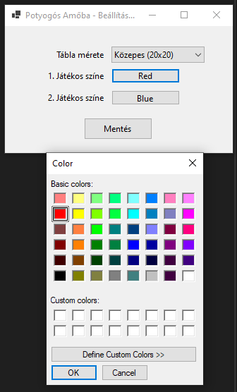
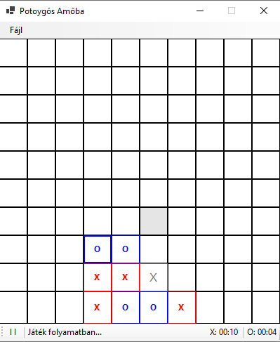
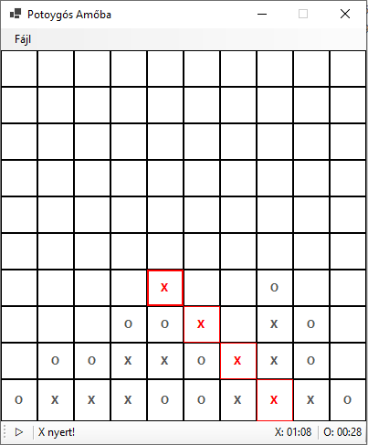
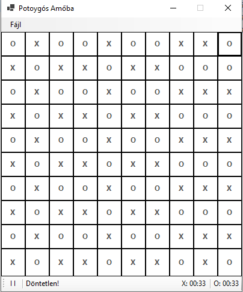

# Connect Four

## Overview

A 2-player game of *Connect Four* using the WinForms library.

> ⚠ The game is only available in Hungarian language

## Features

- Playable game for 2 players
  - Game detects wins and ties
- In-game timer (separately for players)
  - Pausable
- Saving and loading of games
- 3 different board sizes (the code supports arbitrary sizes, but not the *settings* menu)
- Custom colours for players (using the system colour picker)

## Screenshots

### Settings and color picker

### An ongoing game

### A game won by player **X**

### A tied game

## Notes

- The game uses a View-Model-Persistance architecture
- I'm not quite pleased with the code quality, I wrote this in a hurry
